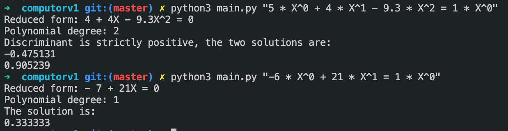

<h1>Description</h1>
Le but de ce projet est de vous faire (re)prendre contact avec la manipulation d’outils mathématiques élémentaires.

Il ne s’agit pas de faire des maths pour faire des maths, mais bien de vous permettre d’aborder plus progressivement et sereinement les sujets où il y en a besoin.

#
Objectifs
- Bases mathématiques
- Equations polynomiales
- Regex

#
