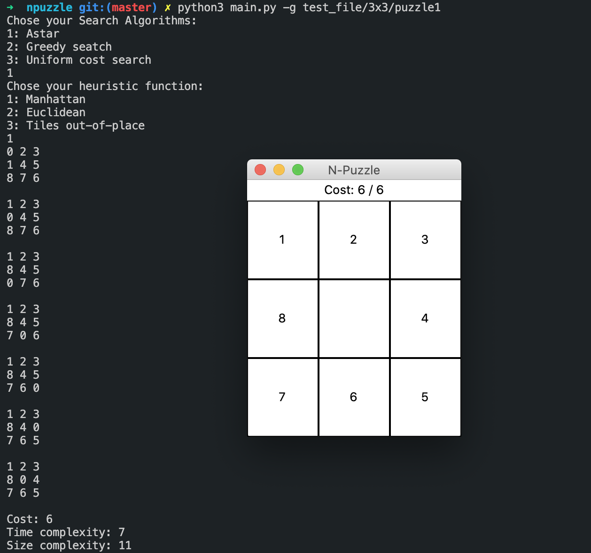

<h1>Description</h1>
Programme capable de résoudre des Taquins de tailles variées, de façon aussi optimale que possible.
 
 

<strong>Objectifs :</strong>
- algorithme de recherche (A*, Greedy, Uniform cost)
- fonctions heuristiques (Manhattan, euclidienne...)
- Optimisation

Avec npuzzle-gen.py, on génère des taquins puis on résout avec ce programme.

usage: python3 ./main.py [-p] [-g] file_name

